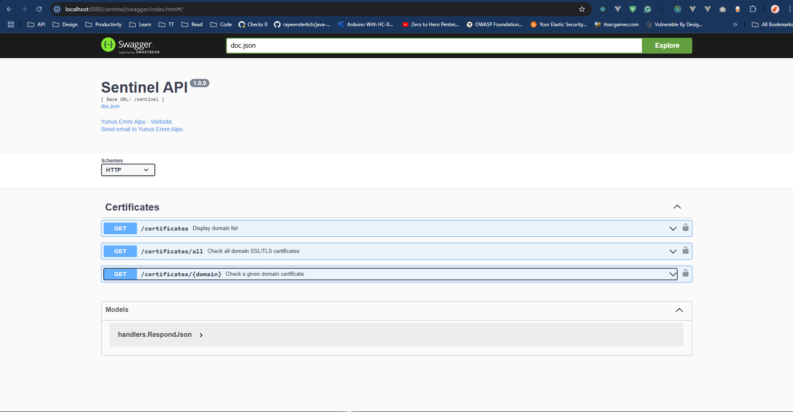
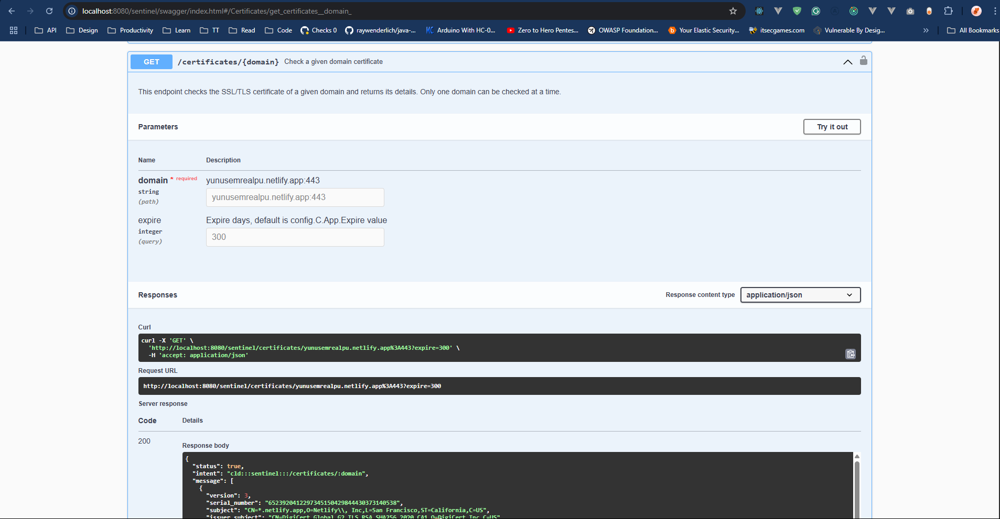
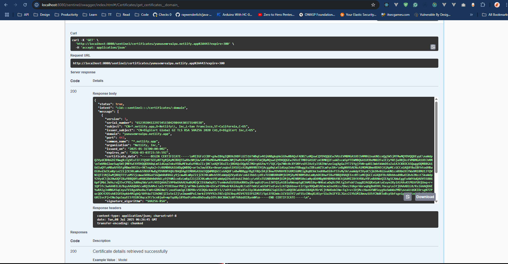

<!-- SENTINEL -->

<br />

<p align="center">
  <a href="assets/sentinel.png" target="_blank">
    <picture>
      
    </picture>
  </a>
</p>

# Sentinel - SSL/TLS Certificate Monitor

**Sentinel** is a high-performance, production-ready SSL/TLS certificate monitoring system built with Go. It continuously monitors certificate expiration dates, provides real-time alerts, and generates comprehensive reports to ensure your digital infrastructure remains secure.

## Key Features

- **Concurrent Processing**: Worker pool with 10 concurrent workers for fast bulk checks
- **Optimized Performance**: Sub-5 second certificate checks with retry logic
- **Graceful Shutdown**: Proper resource cleanup and connection management
- **PostgreSQL + Redis**: Connection pooling and caching for optimal performance
- **Email Notifications**: Automated alerts with Excel reports
- **Swagger API**: Interactive API documentation
- **Distributed Tracing**: Jaeger integration for monitoring
- **Prometheus Metrics**: Built-in performance monitoring
- **CORS Support**: Cross-origin requests enabled
- **Context Timeouts**: Proper timeout handling (30s default, configurable)

## Table of Contents

- [Sentinel - SSL/TLS Certificate Monitor](#sentinel---ssltls-certificate-monitor)
  - [Key Features](#key-features)
  - [Table of Contents](#table-of-contents)
  - [Meaning of Sentinel](#meaning-of-sentinel)
  - [Quick Start](#quick-start)
    - [Prerequisites](#prerequisites)
    - [Installation](#installation)
    - [Configuration](#configuration)
    - [Running](#running)
      - [Direct Run](#direct-run)
      - [Docker](#docker)
  - [Project Architecture](#project-architecture)
    - [Directory Structure](#directory-structure)
  - [API Documentation](#api-documentation)
    - [Accessing Swagger Documentation](#accessing-swagger-documentation)
    - [API Endpoints](#api-endpoints)
    - [Example API Response](#example-api-response)
  - [Contributing](#contributing)

## Meaning of Sentinel

**Mythological Context:**  
In ancient mythology, a sentinel was a watchful guardian posted to warn of approaching danger. These vigilant protectors maintained constant surveillance to ensure safety through immediate alert systems.

**For This Project:**  
Sentinel embodies this guardian spirit by continuously monitoring your SSL/TLS certificates, providing early warnings before expiration, and ensuring your digital infrastructure remains secure.

---

## Quick Start

### Prerequisites

- **Go 1.21+** - [Download](https://go.dev/dl/)
- **PostgreSQL 12+** - For data persistence
- **Redis 6+** - For caching (optional)
- **Docker & Docker Compose** - For containerized deployment (optional)

### Installation

```bash
# Clone the repository
git clone <repository-url>

# Navigate to the project directory
cd Sentinel

# Install dependencies
go mod tidy
```

### Configuration

Create a `.env` file in the `/config` directory based on the provided `sample.env.yaml` template.

### Running

#### Direct Run

```bash
# Start the application
go run main.go

# Or build and run
go build -o sentinel.exe .
./sentinel.exe
```

#### Docker

```bash
# Start all services (Sentinel + PostgreSQL + Redis)
docker-compose up -d

# Check status
docker-compose ps

# View logs
docker-compose logs -f sentinel
```

**Access the API:**

- Swagger UI: <http://localhost:8080/sentinel/swagger/index.html>
- Health Check: <http://localhost:8080/sentinel/health>

---

## Project Architecture

### Directory Structure

```text
Sentinel/
├── assets/                      # Project assets
│   └── sentinel.png            # Logo and images
├── config/                      # Configuration management
│   ├── config.go               # Config loader with Viper
│   └── sample.env.yaml         # Configuration template
├── docs/                        # Auto-generated Swagger docs
│   ├── docs.go
│   ├── swagger.json
│   └── swagger.yaml
├── internal/                    # Private application code
│   ├── handlers/               # HTTP request handlers
│   │   ├── handlers.go         # Router initialization + CORS
│   │   ├── list_certificates.go      # GET /certificates
│   │   ├── get_certificate_info.go   # GET /certificates/:domain
│   │   └── get_all_expirations.go    # GET /certificates/all
│   └── models/                 # Data models
│       ├── log.go              # Certificate log model
│       └── mail.go             # Email notification model
├── pkg/                         # Public reusable packages
│   ├── constants/              # Application constants
│   │   └── constants.go        # Timeouts, status codes, etc.
│   ├── db/                     # Database connections
│   │   ├── postgres/           # PostgreSQL with connection pool
│   │   │   └── db_conn.go      # 60 max, 30 idle connections
│   │   └── redis/              # Redis caching
│   │       └── conn.go
│   ├── logger/                 # Structured logging
│   │   └── logger.go           # Logrus integration
│   ├── mail/                   # Email service
│   │   └── send_mail.go        # SMTP with Excel attachments
│   ├── metric/                 # Prometheus metrics
│   │   └── metric.go
│   ├── parseHtml/              # Template rendering
│   │   └── LogTemplate.go
│   ├── templates/              # HTML email templates
│   │   ├── log.html
│   │   └── welcome.html
│   └── utils/                  # Utility functions
│       ├── cert_checker.go     # Concurrent worker pool
│       ├── retry.go            # Retry logic with exponential backoff
│       ├── helpers.go          # Certificate checking core
│       ├── data.go             # Domain list configuration
│       └── utils.go            # Helper functions
├── Dockerfile                   # Container definition
├── docker-compose.yml          # Multi-container setup
├── go.mod                      # Go module dependencies
├── go.sum                      # Dependency checksums
├── main.go                     # Application entry point
└── README.md                   # Documentation

```

## API Documentation

Sentinel provides comprehensive API documentation through Swagger/OpenAPI specification for easy integration and testing.

### Accessing Swagger Documentation

1. **Start the Application**: Ensure Sentinel is running locally or on a server
2. **Open Browser**: Navigate to `http://localhost:8080/sentinel/swagger/index.html`
3. **Explore**: Use the interactive interface to test API endpoints

### API Endpoints

- **GET `/domains`**: List all monitored domains
- **GET `/certificates/scan`**: Get certificates approaching expiration
- **GET `/certificates/{domain}`**: Get certificate information for a specific domain

### Example API Response

```json
{
  "success": true,
  "path": "/certificates/:domain",
  "data": [
    {
      "version": 3,
      "serial_number": "6523920412297345150429844430373140538",
      "subject": "CN=*.netlify.app,O=Netlify\\, Inc,L=San Francisco,ST=California,C=US",
      "issuer_subject": "CN=DigiCert Global G2 TLS RSA SHA256 2020 CA1,O=DigiCert Inc,C=US",
      "domain": "yunusemrealpu.netlify.app",
      "port": 443,
      "common_name": "*.netlify.app",
      "organization": "Netlify, Inc,",
      "issued_on": "2025-01-31T00:00:00Z",
      "expires_on": "2026-03-03T23:59:59Z",
      "certificate_data": "-----BEGIN CERTIFICATE----\nMIIGFzCCBP\n...",
      "signature_algorithm": "SHA256-RSA",
      "subject_key_id": "3e6abe6e25ac1210abbef1eba7a9bc6d887d548f",
      "authority_key_id": "748580c066c7df37decfbd2937aa031dbeedcd17",
      "is_ca": false,
      "issuer": "DigiCert Global G2 TLS RSA SHA256 2020 CA1",
      "is_expired": false,
      "message": "Certificate will expire in 238 days.",
      "status": 1
    }
  ]
}
```

<!-- Image List -->





## Contributing

We welcome contributions to Sentinel! To contribute to the project, please follow these steps:

- Fork the repository.
- Create a new branch for your feature or bug fix.
- Make your changes and ensure that the tests pass.
- Commit your changes and push them to your fork.
- Submit a pull request to the main repository, describing your changes in detail.
- Please review the Contribution Guidelines for more information.
